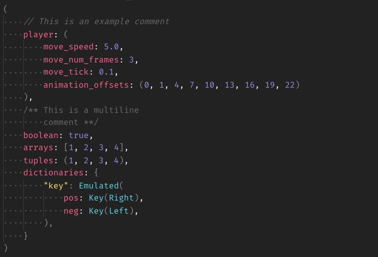

# vscode-ron

vscode-ron is a RON syntax package for VS Code.  Loosely based on
https://github.com/ron-rs/sublime-ron

## Where can I get this?

- [Visual Studio Code Marketplace](https://marketplace.visualstudio.com/items?itemName=a5huynh.vscode-ron)
- [OpenVSX Marketplace](https://open-vsx.org/extension/a5huynh/vscode-ron)

## What is RON?

[Rusty Object Notation](https://github.com/ron-rs/ron) (RON) is a simple
readable data serialization format that looks similar to Rust syntax,
designed to support all of Serde's data model. Check out the RON repository
for more information!

## Highlighting Example

Here's a lovely example of what a basic `.ron` file will now look like:

